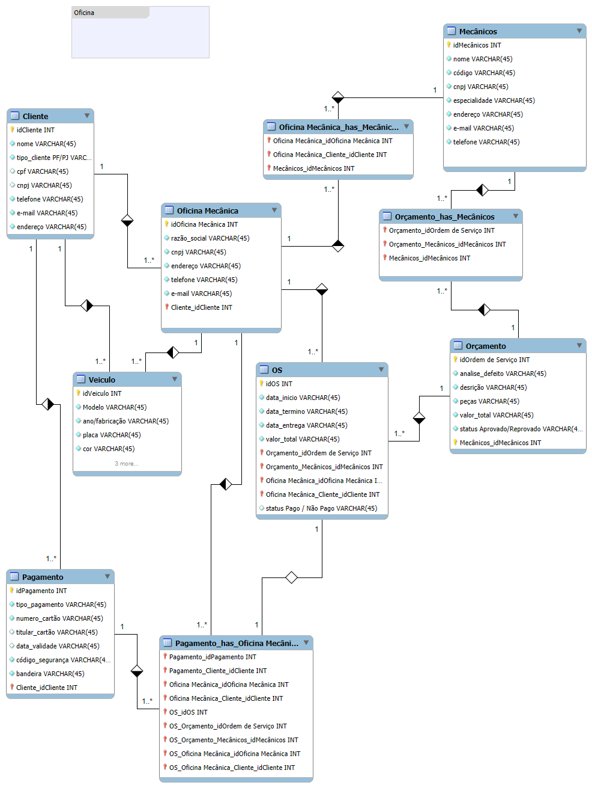

# Projeto: Modelagem de Banco de Dados para Oficina Mecânica

Este documento descreve o processo de modelagem conceitual de um banco de dados para um Sistema de Controle e Gerenciamento de Execução de Ordens de Serviço em uma Oficina Mecânica.

O objetivo deste projeto foi criar o esquema conceitual, identificando entidades, atributos e suas relações, com base na narrativa fornecida.

## Levantamento de Requisitos e Escopo
- O escopo do projeto foi definido em torno do fluxo principal de uma oficina, desde a entrada do veículo até a conclusão da Ordem de Serviço (OS).

- Principais Componentes (Entidades)
- Componente	Descrição (Baseado nos Requisitos)
- Cliente	
Pessoa: que leva o veículo à oficina.

- Veículo	
Objeto do serviço, levado à oficina para conserto ou revisão periódica.

- Mecânico	
Profissional que avalia e executa os serviços. Possui código, nome, endereço e especialidade.

- Ordem de Serviço (OS)	
O documento central do sistema. Possui número (n), data de emissão, valor, status (ex: "Autorizada", "Concluída") e data para conclusão. O cliente deve autorizar a execução dos serviços.

Serviço (Mão-de-Obra)	
Entidade para consultar o valor de cada serviço a ser executado, com base em uma tabela de referência de mão de obra.

- Peça	
Componente que entra no cálculo do valor final da OS.

## Modelagem de Dados: Diagrama Entidade-Relacionamento (DER)
O Modelo Entidade-Relacionamento (MER) foi utilizado para representar a estrutura lógica do banco de dados relacional. O diagrama foi desenvolvido utilizando o MySQL Workbench.

- Relações Chave e Cardinalidades
As cardinalidades garantem a integridade dos dados, estabelecendo como as entidades se conectam para atender aos requisitos:

- Relação	Cardinalidade	Justificativa (Baseada nos Requisitos)
Cliente e Veículo	1:N (Um para Muitos)	
Um Cliente pode possuir e levar muitos Veículos à oficina.

- Veículo e Ordem de Serviço (OS)	1:N (Um para Muitos)	
Um Veículo pode gerar múltiplas Ordens de Serviço ao longo do tempo (consertos, revisões).

OS e Serviço/Peça	N:M (Muitos para Muitos)	
Uma OS é composta por vários Serviços e várias Peças. Um Serviço ou Peça pode aparecer em múltiplas OS. Esta é uma relação fundamental para o cálculo do valor final da OS.

## Arquitetura do Banco de Dados
Introdução ao Banco de Dados
O SGBD relacional é ideal para este projeto, pois requer alta integridade transacional (ACID) para registrar com precisão o cálculo dos valores e o status da Ordem de Serviço.

- Foco da Arquitetura

Persistência de Dados: Garantir que todos os dados dos mecânicos, veículos e o histórico de serviços sejam armazenados de forma segura.

### Conclusão e Aprendizados
A modelagem de dados para a Oficina Mecânica demonstra a capacidade de traduzir uma narrativa de negócios em um esquema lógico e consistente.

- Principais Aprendizados:

Modelagem de Processos: Compreensão do ciclo de vida da Ordem de Serviço, que é a entidade central que conecta clientes, veículos, equipes e itens de custo.

Tratamento de Custo Variável: Implementação da estrutura N:M (através de tabelas associativas) entre OS e Serviço/Peça para detalhar os itens de custo e permitir o cálculo dinâmico do valor total da OS.

## License

[MIT](https://choosealicense.com/licenses/mit/)